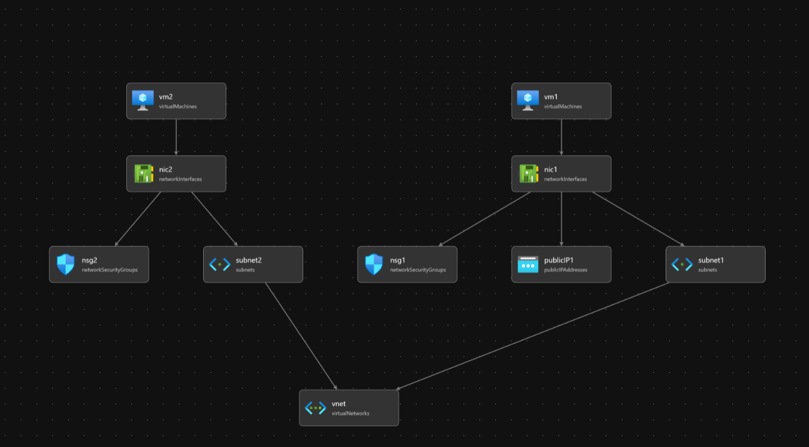

<<<<<<< HEAD
# bicep-templates

## Helpful resources

- [Azure Bicep templates vnet two subnets](https://github.com/Azure/azure-quickstart-templates/blob/master/quickstarts/microsoft.network/vnet-two-subnets/main.bicep)
- [Azure Bicep templates vm-simple-linux](https://github.com/Azure/bicep/blob/main/docs/examples/101/vm-simple-linux/main.bicep)
- [Azure best practices for network security](https://docs.microsoft.com/en-us/azure/security/fundamentals/network-best-practices#use-strong-network-controls)
- [Azure network security overview](https://docs.microsoft.com/en-us/azure/security/fundamentals/network-overview#network-access-control)

## Architecture diagram

=======
# bicep-templates

## Resources

- [Azure Bicep templates vnet two subnets](https://github.com/Azure/azure-quickstart-templates/blob/master/quickstarts/microsoft.network/vnet-two-subnets/main.bicep)
- [Azure Bicep templates vm-simple-linux](https://github.com/Azure/bicep/blob/main/docs/examples/101/vm-simple-linux/main.bicep)
- [Azure best practices for network security](https://docs.microsoft.com/en-us/azure/security/fundamentals/network-best-practices#use-strong-network-controls)
- [Azure network security overview](https://docs.microsoft.com/en-us/azure/security/fundamentals/network-overview#network-access-control)

## Architecture diagram

>>>>>>> 922d8b2c4550b1388ea6d23d57c503343d7fbde1
